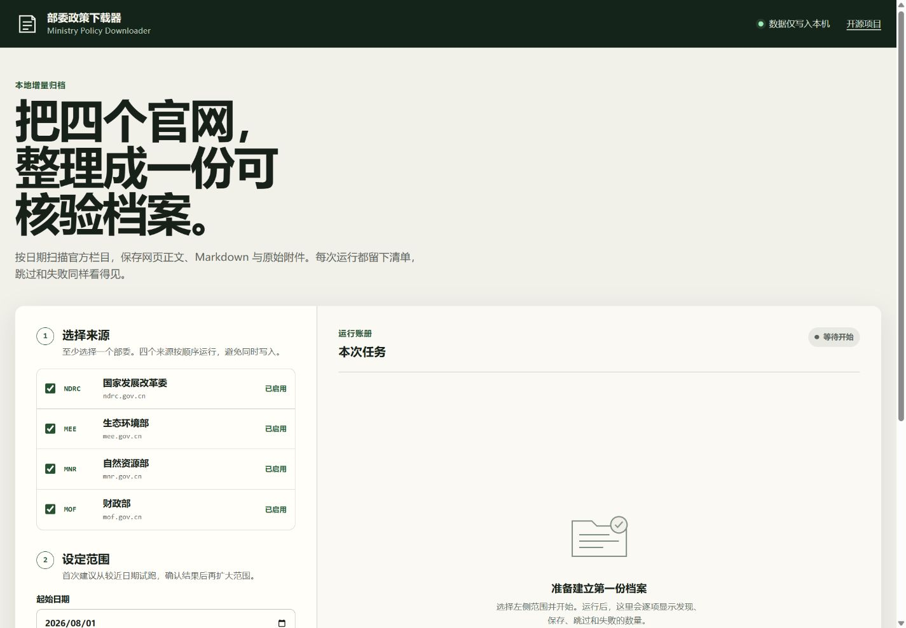

# Ministry Policy Downloader / 部委政策下载器

一个面向中国政府公开政策资料的本地归档工具：按日期增量采集索引，保存正文与附件，并生成可审计清单。

[](https://github.com/Lcub3d/ministry-policy-downloader/actions/workflows/tests.yml)
[](https://www.python.org/)
[](LICENSE)



> [!IMPORTANT]
> 本项目是非官方社区工具，与任何政府部门无隶属或背书关系。采集成功仅表示已配置栏目的索引流程完成，不代表官网全部历史内容绝对完整。

## 已支持来源

| 代码 | 部门 | 官网 |
|---|---|---|
| `ndrc` | 国家发展和改革委员会 | `ndrc.gov.cn` |
| `mee` | 生态环境部 | `mee.gov.cn` |
| `mnr` | 自然资源部 | `mnr.gov.cn` |
| `mof` | 财政部 | `mof.gov.cn` |

## 安装

需要 Python 3.10 或更高版本。

克隆仓库后，在项目目录创建独立环境并安装：

```bash
git clone https://github.com/Lcub3d/ministry-policy-downloader.git
cd ministry-policy-downloader
python -m venv .venv
```

Windows PowerShell：

```powershell
.\.venv\Scripts\Activate.ps1
python -m pip install -e .
```

macOS / Linux：

```bash
source .venv/bin/activate
python -m pip install -e .
```

## 快速开始

安装后既可以使用命令行，也可以启动本地网页界面。每次发布前会用下面的 `--help` 例子验收安装包。

查看当前版本支持的命令和参数：

```bash
policy-harvester --help
```

不写入归档，先预览索引候选 JSON：

```bash
policy-harvester preview --source ndrc --since 2026-08-01
```

从指定日期开始更新某一来源：

```bash
policy-harvester update --source ndrc --since 2026-08-01 --output ./data
```

一次更新全部已支持来源：

```bash
policy-harvester update --source all --since 2026-08-01 --output ./data
```

`--source` 可重复使用，例如 `--source ndrc --source mee`。命令行拒绝小于 0.2 秒的请求间隔。

离线审计归档状态与本地缺失文件：

```bash
policy-harvester audit --output ./data
```

审计发现待处理、失败或缺失文件时返回退出码 2，便于脚本和定时任务识别不完整状态。

### 本地网页界面

启动网页界面，默认仅监听本机 `127.0.0.1:8765` 并自动打开浏览器：

```bash
policy-harvester serve
```

如果不希望自动打开浏览器：

```bash
policy-harvester serve --no-browser
```

可通过 `--port` 修改端口。不要将界面绑定到公网地址；它是无身份验证的单机工具，并且能够启动下载任务。

输出目录由命令行参数决定；仓库不包含任何预采集正文、附件、本地绝对路径或个人工作簿。

## 设计边界

- 默认增量运行，重复执行不应重复下载已完成文件。
- 首版收录所选官方来源中已配置栏目的全部条目，不用标题关键词自动排除内容。
- 先生成索引，再处理正文和附件；失败不伪装成成功。
- 索引如果直接指向 PDF、DOC、XLS 等文件，该文件按政策条目的原始附件归档，不会伪造 HTML 或 Markdown 正文；清单中会标记为直链文件。
- 附件保留官网提供的正常文件名，仅在同目录内不同 URL 真实重名时追加短哈希。
- 部分财政部官方索引与附件仍提供 `http://` 链接。下载器保留官网给出的协议，不声称原始来源从未使用 HTTP，也不会在未验证兼容性时强制改写为 HTTPS。
- 保留请求间隔并尊重站点限流；不绕过登录、验证码、访问控制或其他技术限制。
- 官网改版、撤回文件、网络故障和永久远端缺口都可能造成本地缺失。

“已配置栏目完整”仅表示本次运行把适配器列出的栏目与分页处理完毕。它不是对官网所有搜索入口、历史迁移页面、已撤回内容或未公开资源的绝对完整性证明；重要用途请结合 `audit` 结果和官网人工复核。

## 路线图与参与

首个 30 天的公开发布、反馈与传播安排见 [LAUNCH_PLAN.md](LAUNCH_PLAN.md)。200 Stars 是挑战目标，不是结果承诺；欢迎通过 Issue 报告栏目改版、缺失样例或新的部委适配需求。

## 开发

```bash
python -m unittest discover -s tests -v
python -m pip install build
python -m build
```

站点解析回归测试必须使用本地合成 HTML，不在 CI 中请求政府官网。贡献规则见 [CONTRIBUTING.md](CONTRIBUTING.md)，安全问题见 [SECURITY.md](SECURITY.md)。

## 许可与内容权利

项目源代码按 [MIT License](LICENSE) 许可。由工具访问或下载的政府网页、附件、徽标和其他第三方内容不因此获得 MIT 许可，其权利归原始权利人所有。详见 [NOTICE](NOTICE)。
